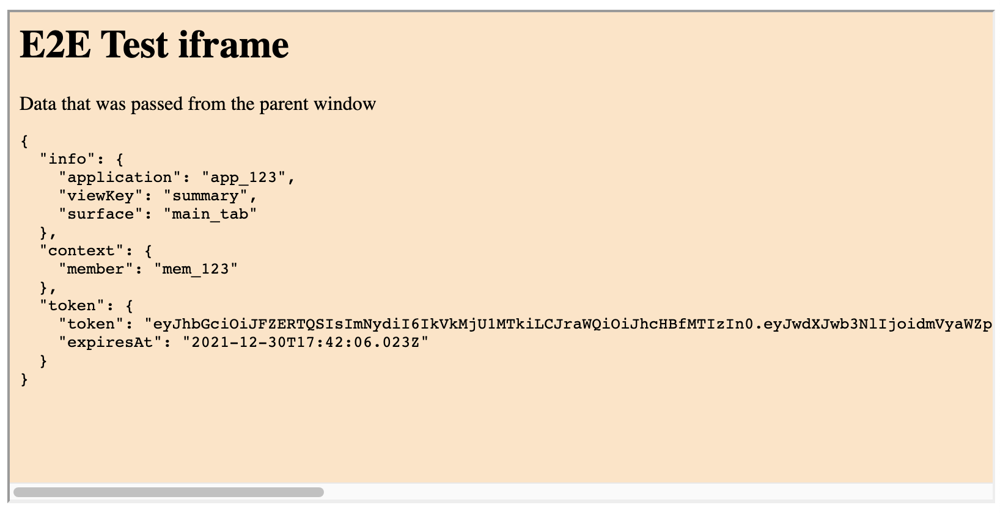

# Source Example Frame Plugin

This is an demonstration of how to write an iframe plugin for Source Health. In
this project we have two simple iframe html files with accompanying Typescript
scripts:

1. demo_plugin.html - this performs the Source Bridge handshake and displays the
   context and application token it has received from the parent window.
2. backend_demo_plugin.html - this takes the Source application token and
   submits it to a simple demo backend API which verifies the token and returns the
   details from it which are then displayed in the iframe. (This plugin cannot be configured as a 'real' Source plugin because the backend uses a hard-coded application public key.)

We have also included an html file (parent.html) that simulates the Source web
application allowing us to do some local development and demonstration without
having to configure a plugin in Source itself.

The main repository for this demo is https://github.com/source-health/source-demo-frame-plugin

# How to use

Source has created a [Glitch
app](https://glitch.com/edit/#!/source-demo-frame-plugin) that can be accessed
and freely remixed to get you started with building a Source plugin. This repo can also be cloned and run locally too.

## Glitch App

### See the demo plugin in the fake 'parent' app

Load https://source-demo-frame-plugin.glitch.me/demo.html

### Setup the demo plugin in your Source account

1. Configure a Source application with a view like:

```
{
  surface: 'main_tab',
  type: 'frame',
  key: 'demo',
  label: 'Demo Plugin',
  frame_url: 'https://source-demo-frame-plugin.glitch.me/demo_plugin.html'
}
```

2. Reload the Source web application.
3. Visit a member chart
4. Click on the 'Demo Plugin' chart
5. You should see the demo iframe content, which will look like this:
   
   This indicates that the plugin was able to successfully complete the handshake via Source Bridge, and has received the context and authentication token it needs.

# Local development

## Simple Demo

There is no backend for the simple demo plugin, you can run the frontend build in dev mode:

```
npm run frontend:watch
```

Load the demo app at http://localhost:3001/demo.html

## Backend Demo

The backend demo has a simple Express API that has a hardcoded key pair for signing and verifying Source application tokens. It has two endpoints:

- `/api/token` - simulates the Source backend API which provides application
  tokens to authenticated users. This demo has no authentication.a
- `/api/echo` - will decode and verify the Source application token, returning the
  user ID and application ID back to the iframe plugin.

Run the backend in watch mode:

```
npm run backend:watch
```

Build the frontend in watch mode:

```
npm run frontend:watch
```

Load the dummy parent app in a browser e.g. http://localhost:3001/backend_demo.html

# Notes

## Typescript on Glitch

As you can see from package.json, we have defined our `npm run start` script to
do the following:

1. Build the frontend (with vite), then
2. Start the backend server with `ts-node`.

This makes the application fairly slow to wake up or refresh but is tolerable
for a demo.

### Editing in Glitch

If you are using typescript on Glitch, you might notice that your changes do not
refresh the page. It seems that Glitch only listens for javascript files with
.js extensions.

We can work around that limitation by running this command in the Glitch
terminal when developing, to monitor your TS files, and automatically refresh
the app if need be.

```sh
npm run glitch:watch
```

Your typescript file will not be built by this watch command since the app uses
ts-node to directly run the typescript files.

This Glitch App was based on the
[glitch-ts-node](https://github.com/codiechanel/glitch-ts-node) starter app.
